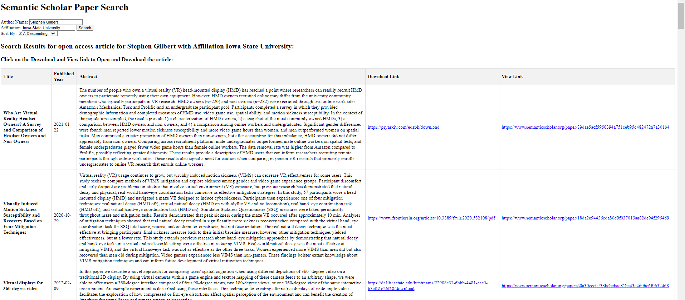

# Semantic Scholar Paper Search - Developer's Guide
## Overview
The Semantic Scholar Paper Search website allows you to search for articles by the author's name using Semantic Scholar. It can search all the articles within Semantic Scholar and display the papers based on filters such as Affiliation and Open Access.

## Features

- Search articles by Author's name.
- Filter papers based on Affiliation and Open Access.
- Display paper title, publication date, abstract, download link, and viewable link.
- Sort displayed papers in ascending and descending alphabetic order.

## Installation and Deployment
Please Refer to the user guide/README for more details
## User Interaction and Flow
### Interaction
The user interaction flow in Semantic Scholar Paper Search involves the following steps:
1.	User accesses the web application by navigating to the application URL.
2.	The application's main page is displayed which contains two text entry fields for author name and affiliation.
3.	Users have two options:
I.	Enter only the author’s name leaving the affiliation field blank. This will import the first list from the raw data given by Semantic Scholar API.
II.	Enter both author name and affiliation. This will filter the raw data and extract the list of papers that are affiliated with the given affiliation. Note: If an affiliation that is not associated with the raw dat ais given, option I will be initialized.
4.	The website will display an error message if numerical value is given in author name field.
5.	If all the values are given accordingly: title, publication date, abstract and link to view and download the paper is displayed. The program filters out the paper that is not affiliated with the given affiliation and if the paper is not open access.
6.	Users can sort the papers based on four different options.
I.	Sort according to ascending English alphabets i.e., A to Z.
II.	Sort according to descending English alphabets i.e., A to Z.
III.	Sort according to ascending Published date.
IV.	Sort according to descending Published date.
7.	User now can download the paper and view semantic scholar website where it is stored.
### Flow
#### Website Main Page

#### Searching papers without affiliation

#### Searching papers with affiliation

#### Error Message if numeric value is given for search

#### Sorting

## Code Structure
The main Flask application (app.py) is responsible for handling user requests and rendering templates. The project is organized into several modules:
  app.py: Contains the main Flask application and routes.
  index.html: Contains html and java scripts to render the website. All the function like sorting, making table, displaying error message and making text hyperlink are done in html file.
## Modules
    * flask: The Flask web framework.
    * semantic scholar: To access the Semantic Scholar API.
## Functions
    * search_paper_by_author (author_name, affiliation): Takes author name and affiliation and search in Semantic Scholar.
    * filter_by_affiliation(data, affiliation): Filters the data given by semantic scholar API based on the affiliation provided by the users.
    * index(): Handles the logic for rendering the HTML page and processing form submissions.
    * error(): Handles the situation when error happens. Specially to return to the main page.
## Known Issues
The page will display out of Bound error if user provide the author name that is not registered or who does not have paper in semantic scholar.
